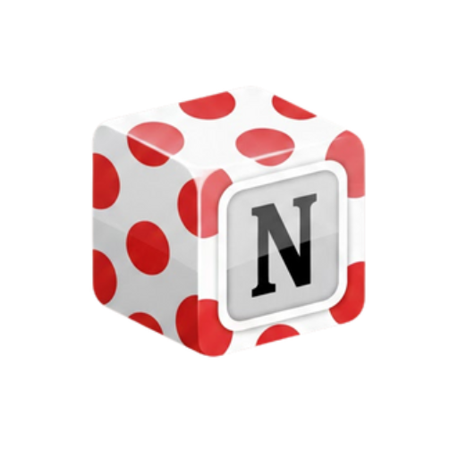

# NotionSync

<p align="center">
  
</p>

<p align="center">
  <strong>Sync your Canvas LMS assignments to Notion — automatically.</strong>
</p>

<p align="center">
  <a href="#features">Features</a> •
  <a href="#installation">Installation</a> •
  <a href="#quick-start">Quick Start</a> •
  <a href="#usage">Usage</a> •
  <a href="#configuration">Configuration</a> •
  <a href="#contributing">Contributing</a>
</p>

---

## Overview

**NotionSync** is a cross-platform desktop application that bridges Canvas LMS and Notion. It automatically syncs your assignments from Canvas courses into a Notion database, helping students organize deadlines, plan study sessions, and stay on top of their coursework — all in one place.

### Why NotionSync?

- 📚 **All assignments in one place** — No more switching between Canvas and your planner
- ⏰ **Smart time blocking** — Generate study blocks based on assignment priority and deadlines
- 🔄 **Automatic sync** — Set it and forget it with scheduled background syncs
- 🔒 **Secure** — API keys stored in your OS keychain, never in plain text

---

## Features

### 📥 Canvas to Notion Sync
- Fetch assignments from multiple Canvas courses
- Sync assignment details: name, due date, points, course, URL, and more
- Smart deduplication using Canvas assignment IDs
- Filter by sync buckets: Past, Undated, Upcoming, Future, Ungraded

### ⏱️ Time Block Generator
- **Priority Scoring System** — Configurable weights for points, urgency, and exam bonuses
- **Weekly Availability** — Define your available study hours per day
- **Smart Suggestions** — AI-powered schedule analysis with workload assessment
- **Notion Export** — Push generated time blocks directly to Notion

### 🔔 Notification System
- Configurable alerts for sync success, errors, and time block generation
- Optional sound notifications
- **Cross-platform support** — Works on macOS, Windows, and Linux

### ⌨️ Keyboard Shortcuts
| Shortcut | Action |
|----------|--------|
| `Ctrl+R` | Run sync |
| `Ctrl+1` | Assignments tab |
| `Ctrl+2` | Timeblocker tab |
| `Ctrl+3` | Logs tab |
| `Ctrl+,` | Open settings |
| `Ctrl+T` | Test connections |
| `Ctrl+Q` | Quit |

All shortcuts are fully customizable via Settings.

### 🎨 Modern UI
- Clean, collapsible sidebar with smooth animations
- System tray integration for background operation
- Dark/light theme support (via `qt-material`)
- Organized settings with collapsible sections

### 🔌 Connection Testing
- One-click Canvas API connection test
- Notion API and database access verification
- Visual feedback with status indicators (✅/❌)

---

## Installation

### Prerequisites
- Python 3.10 or higher
- A Canvas LMS account with API access
- A Notion account with an integration set up

### Clone the Repository

```bash
git clone https://github.com/fcanas574/NotionSync.git
cd NotionSync
```

### Install Dependencies

```bash
python3 -m pip install -r requirements.txt
```

### Dependencies
- **PyQt6** — Desktop GUI framework
- **requests** — HTTP client for API calls
- **keyring** — Secure credential storage
- **schedule** — Background task scheduling
- **qt-material** (optional) — Material Design theming

---

## Quick Start

### 1. Get Your API Keys

**Canvas API Token:**
1. Log into Canvas → Account → Settings
2. Scroll to "Approved Integrations" → New Access Token
3. Copy the token

**Notion Integration:**
1. Go to [notion.so/my-integrations](https://www.notion.so/my-integrations)
2. Create a new integration
3. Copy the Internal Integration Token
4. Share your target database with the integration

### 2. Run NotionSync

```bash
python3 CanvasAssignments.py
```

### 3. Configure
1. Enter your Canvas API Key, Notion API Key, and Database ID
2. Click "Test Canvas" and "Test Notion" to verify connections
3. Load courses and select which ones to sync
4. Hit **Sync Now**!

---

## Usage

### GUI Mode (Default)
```bash
python3 CanvasAssignments.py
```
Full interactive interface with all features.

### Daemon Mode
```bash
python3 CanvasAssignments.py --daemon
```
Runs in the system tray with scheduled daily syncs.

### Background Sync
```bash
python3 CanvasAssignments.py --background
```
One-off sync without the full GUI — perfect for cron jobs or automation.

---

## Configuration

### Sync Buckets
Control which assignments to sync:
- **Past** — Already due assignments
- **Undated** — Assignments without due dates
- **Upcoming** — Due within the next 7 days
- **Future** — Due more than 7 days out
- **Ungraded** — Assignments not yet graded

### Time Blocker Settings
- **Block Duration** — Length of each study block (15-120 min)
- **Max Blocks/Day** — Limit daily study blocks
- **Points Weight** — How much assignment points affect priority
- **Urgency Weight** — How much deadline proximity affects priority
- **Exam Bonus** — Extra priority for exam-related assignments

### Data Storage
| Data | Location |
|------|----------|
| Config & Logs | OS app data folder (e.g., `~/Library/Application Support/NotionSync/` on macOS) |
| API Keys | OS keychain via `keyring` — never stored in plain text |

---

## Notion Database Setup

NotionSync will automatically check for required properties. Your database should include:

| Property | Type | Description |
|----------|------|-------------|
| Name | Title | Assignment name |
| Due Date | Date | Assignment due date |
| Course | Select | Course name |
| Points | Number | Points possible |
| Canvas URL | URL | Link to Canvas assignment |
| Canvas ID | Number | Unique identifier (for deduplication) |
| Status | Select | Assignment status |

---

## Building from Source

### PyInstaller (Desktop App)
```bash
pyinstaller NotionSync.spec
```
Output: `build/NotionSync/` and `dist/`

---

## Branches

| Branch | Purpose |
|--------|---------|
| `main` | Stable release |
| `beta-0.1` | Testing and experimental features |

---

## Known Limitations
- Linux autostart integration is not fully implemented
- Notion database must have compatible property types
- Canvas webhooks not supported (polling only)

---

## Contributing

Contributions are welcome! Here's how to help:

1. **Fork** the repository
2. **Create** a feature branch (`git checkout -b feature/amazing-feature`)
3. **Commit** your changes (`git commit -m 'Add amazing feature'`)
4. **Push** to the branch (`git push origin feature/amazing-feature`)
5. **Open** a Pull Request

### Guidelines
- Keep PRs focused and small
- Test your changes before submitting
- Update documentation if needed

---

## Roadmap

- [ ] Grade/score sync from Canvas
- [ ] Google Calendar integration
- [ ] Assignment dependencies tracking
- [ ] Pomodoro timer integration
- [ ] Mobile companion app

---

## License

This project is licensed under the MIT License — see the [LICENSE](LICENSE) file for details.

---

## Acknowledgments

- [Canvas LMS API](https://canvas.instructure.com/doc/api/)
- [Notion API](https://developers.notion.com/)
- [PyQt6](https://www.riverbankcomputing.com/software/pyqt/)
- [keyring](https://github.com/jaraco/keyring)

---

<p align="center">
  Made with ❤️ for students everywhere
</p>
